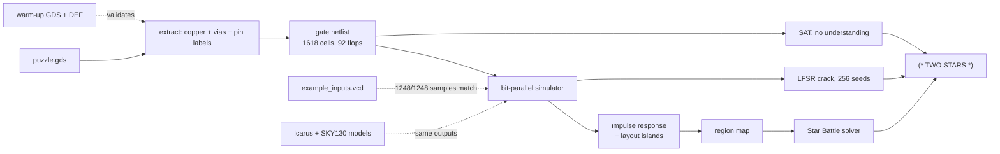
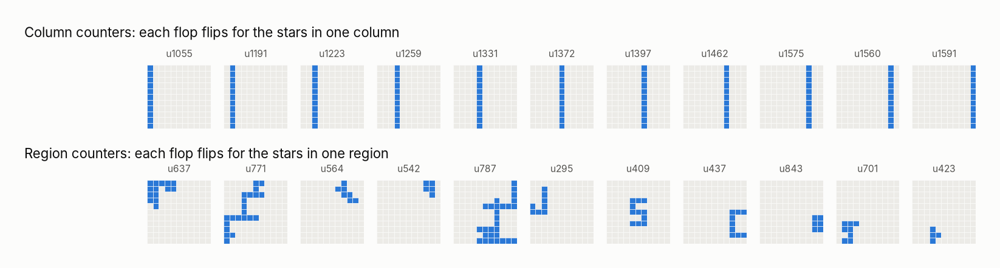
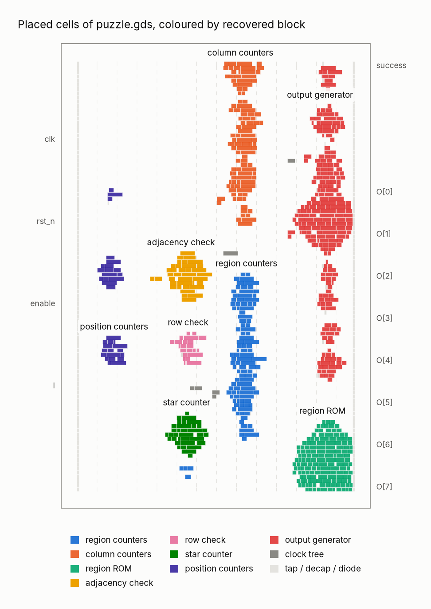
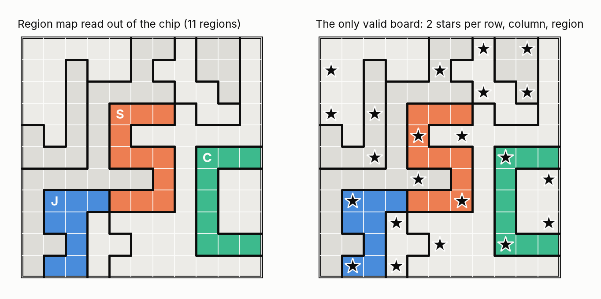
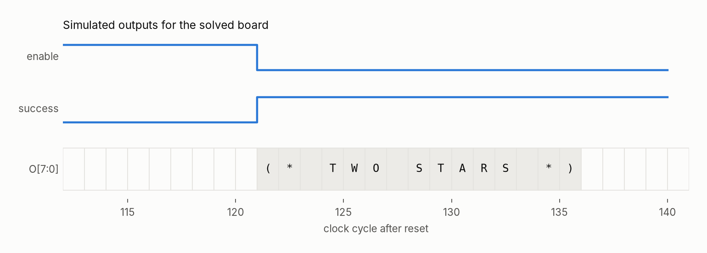
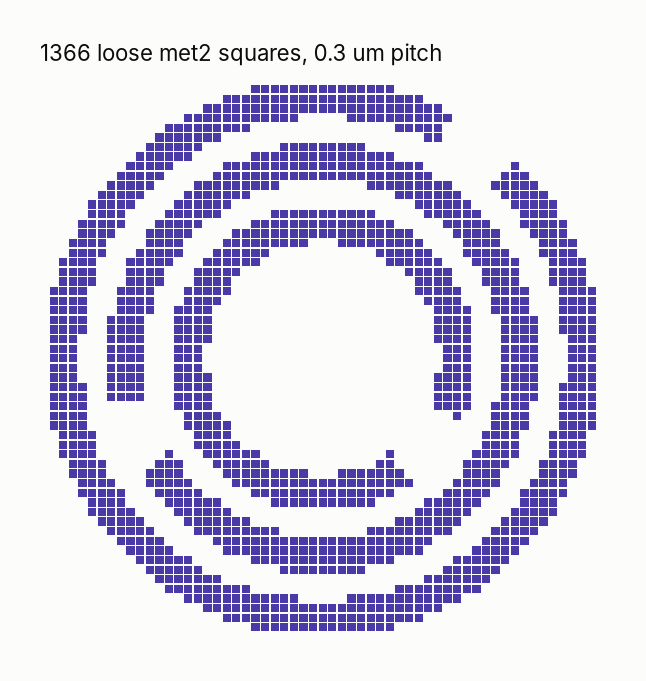
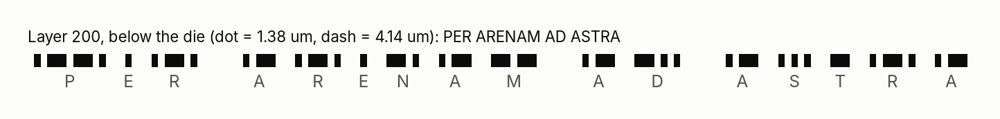
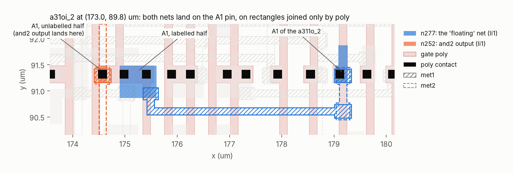

# Reverse engineering the Jane Street ASIC puzzle

In August 2026 Jane Street published [a puzzle](https://blog.janestreet.com/can-you-reverse-engineer-an-asic/):
here is the final GDS layout of a small chip, with no netlist and no signal names. Work out what it
does, then get it to print the string it is hiding.

This repository solves it from the polygons up. Every step is a script you can run, and every claim
in this README is checked by a test. The goal is that someone who has never opened a GDS file can
follow the whole chain: layout, netlist, simulation, understanding, answer.

```
git clone --recursive https://github.com/danieltyukov/jane-street-asic-puzzle
cd jane-street-asic-puzzle
make setup pdk     # Python venv + the SKY130 HD standard cell library (via ciel)
make all           # runs the full solve in about 15 seconds
```

<details>
<summary>The answer (spoiler)</summary>

The chip is a hardware checker for an 11x11 Star Battle puzzle. Feed it the only valid board and
`success` goes high, then the output bus spells **`(* TWO STARS *)`**.

</details>

## What is in here

| Step | Command | What it does |
|---|---|---|
| Extract | `asicre extract` | Rebuilds the gate-level netlist from `puzzle.gds` (own extractor, KLayout for geometry) |
| Validate | `asicre warmup` | Runs the same extractor on the warm-up GDS and compares it with the reference DEF |
| Simulate | `asicre replay` | Replays `example_inputs.vcd` through a bit-parallel gate simulator |
| Understand | `asicre analyze` | Impulse-response experiment plus layout clustering; reads the region map out of the chip |
| Solve | `asicre solve` | Solves the Star Battle with z3 and feeds the board back to the chip |
| SAT | `asicre sat` | Finds the winning input straight from the netlist, with no idea what the chip does |
| Crack | `asicre crack` | Recovers the output LFSR and decodes the message ROM by trying all 256 seeds |
| Eggs | `asicre eggs` | Finds all seven Easter eggs |
| Cross-check | `asicre crosscheck` | Compares the simulator against Icarus Verilog with the official SKY130 cell models |
| Poly | `asicre poly` | Extracts again following gate poly, which explains the "floating wire" egg |
| Magic | `asicre magic` | Compares against an independent extraction by Magic VLSI |

`asicre all` runs all of them and writes `build/results.json`, `build/results.log`, the extracted
Verilog (`build/puzzle_extracted.v`) and a waveform of the winning run (`build/solution.vcd`).

The long walkthrough, with the reasoning behind each step, is in [docs/WRITEUP.md](docs/WRITEUP.md).
How to look at the files yourself in KLayout, Magic, Surfer and friends is in
[docs/TOOLS.md](docs/TOOLS.md).

## How the solve works



### 1. Getting a netlist out of the layout

A GDS file is only polygons on numbered layers. The puzzle keeps the name of every standard cell
(`sky130_fd_sc_hd__nand2_2` and so on) and the pin labels drawn inside each cell, but nothing at the
top level except the I/O pins. The extractor in [`src/asicre/extract.py`](src/asicre/extract.py) does
what an LVS tool does, in about 200 lines:

1. Flatten li1 and met1 to met5 and merge touching shapes. Each merged polygon is one piece of metal.
2. Every via joins the polygon below it to the polygon above it. A union-find over all polygons
   turns that into nets.
3. For every placed cell, move its pin labels into chip coordinates and look up the polygon under
   each one. That polygon's net is the pin's net.

It finishes in under two seconds and finds 1618 cells, 92 flip-flops and zero vias that land on
nothing. Before trusting it on the puzzle, it runs on the warm-up adder, where the post-route DEF
still has the real names: all 230 instances and all 84 nets match exactly.

### 2. Simulating it

[`src/asicre/sim.py`](src/asicre/sim.py) reads each cell's boolean function from the SKY130 Liberty
file, sorts the 642 combinational gates topologically, and compiles them into a single Python
function. Every net is a Python integer, and bit k of it belongs to simulation k, so one pass
simulates hundreds of inputs at once.

Matching the sample waveform is necessary but not enough (the results post describes a model that
matched it with every tie cell wrong). So there are three checks:

- `example_inputs.vcd`: 312 clock cycles, 1248 output samples, zero mismatches. The chip answers
  `TRY AGAIN` twice.
- The warm-up adder: `S == (A + B == 496)` for 1024 random and edge-case inputs.
- Icarus Verilog, running the extracted netlist against the official SKY130 cell models: 1903
  cycles across 13 different boards, zero mismatches. The only cycles Icarus cannot decide (it
  shows X) are the 8 that depend on the floating wire from egg 7.

### 3. Working out what it does

The trick that cracks it open: run 122 simulations at once. Lane p places a single star at board
position p, the last lane places none. At the end, compare every flip-flop to the empty lane. A flop
that "heard" a star changed, and the set of positions it heard tells you its job.



Eleven flops hear exactly one column each. Eleven more hear irregular groups that partition all 121
cells: those are region counters, and their groups are the puzzle's regions. Twelve flops only hear
the last twelve positions (a delay line, used to check neighbours). One flop hears every position
(the lowest bit of a star counter), and eight hear a scrambled mix (an LFSR in the output logic).

The layout says the same thing from the other side. Clustering the placed cells gives islands, one
per RTL module, which is the hint Jane Street left in the floorplan:



| Block | What it holds |
|---|---|
| position counters | 4-bit column and row counters (0 to 10) and a done flag after 121 inputs |
| row check | one 2-bit counter reused for every row, plus a sticky flag if a row ends without exactly 2 stars |
| column counters | eleven 2-bit counters, one per column |
| region ROM | 147 gates of pure logic mapping (row, column) to a region |
| region counters | eleven 2-bit counters, one per region |
| adjacency check | a 12-stage delay line (one row plus one cell) and a sticky flag if two stars touch |
| star counter | a 7-bit count of all stars, used to pick some of the failure messages |
| output generator | the LFSR, a 15-byte message ROM, the byte counter and the `success` flop |

### 4. Solving it

The region map, read straight out of the region counters, has 11 regions. Three of them are drawn as
letters:



z3 finds exactly one board with two stars in every row, column and region and no two stars touching.
Fed to the extracted chip, `success` rises on the clock after the 121st bit and the output bus plays
the message one byte per cycle:



### 5. Two more ways in

**SAT, without understanding anything.** [`src/asicre/sat.py`](src/asicre/sat.py) unrolls the netlist
for 121 input cycles plus a few idle ones, gives every flop fresh variables each cycle, and asks z3 for
an input sequence that makes `success` true. It finds one in a fraction of a second, proves there is no
second one, and it is the same board.

**Cracking the output generator.** While the board streams in, every bit is XORed into the feedback of
an 8-bit LFSR, `x^8 + x^6 + x^5 + x^4 + 1` (the textbook maximal-length one, period 255). When the board
is right, each output byte is `ROM[k] XOR state`, and the state jumps 8 steps per byte. Both facts are
recovered from traces, not read off gates. Faking `success` on a wrong board gives the 15 ROM bytes;
trying all 256 seeds gives exactly one printable decode, and its seed (`0x65`) is the signature of the
solved board.

## The Easter eggs

All seven, found by [`src/asicre/eggs.py`](src/asicre/eggs.py):

| # | Where | What |
|---|---|---|
| 1 | `example_inputs.vcd` | The two failed attempts carry one 7-bit ASCII character per board row (bit 0 in column 0): `The night sky awaits` |
| 2 | VCD header | `$date Sat Dec 31 23:59:60 2016`, a real leap second, and a `$version` telling you to use a waveform viewer |
| 3 | Layer 200, below the die | 36 marks in Morse code, with textbook timing (dash = 3 dots, gaps of 1, 3 and 7): `PER ARENAM AD ASTRA`, "through the sand, to the stars" |
| 4 | Failure messages | empty board `EMPTY SKY`, full board `BIG BANG`, counts right but stars touching `TWO NOT TOUCH`, anything else `TRY AGAIN` |
| 5 | met2 | 1366 small squares, wired to nothing, draw a 57x57 Jane Street logo |
| 6 | Region map | three regions are the letters J, S and C |
| 7 | The `TWO NOT TOUCH` path | a wire that looks unconnected, so many simulations print `TWO"NOT TOUCH` |





### A closer look at egg 7

A metal-only extraction (this one, and most label-based ones) finds the A1 inputs of an `a31oi_2`
and an `a311o_2` on a net with no driver. Tied low, the chip prints `TWO"NOT TOUCH`: the quote is a
space with bit 1 set. Tied high it prints garbage. Six nearby nets would fix the message, so
simulation alone cannot say which one was meant.

The geometry can. The SKY130 LEF declares the `a31oi_2` A1 pin as two li1 rectangles that only meet
through the cell's gate poly, and only one of them carries a text label. The router landed the
`and2` output on the unlabelled half and ran the wire to the `a311o` from the labelled half:



Following poly (`asicre poly`) merges exactly that one pair of nets and nothing else, and the chip
then prints `TWO NOT TOUCH`. Magic, which extracts poly, agrees: its netlist is graph-identical to
the poly-aware one (same Weisfeiler-Lehman signature, same cell counts) and gives the same outputs on
26 test boards. So the signal does reach both gates, through the a31oi's poly. Jane Street's results
post says the wire started as a layout bug that their LVS run caught, and that they left it in as an
egg.

## Repository layout

```
src/asicre/
  extract.py     GDS to netlist (union-find over merged copper, pins from labels)
  liberty.py     Liberty parser and boolean expression compiler
  sim.py         cycle-based, bit-parallel gate simulator
  analysis.py    impulse response, flop roles, region map, layout islands
  starbattle.py  z3 Star Battle solver and checker
  sat.py         bounded model checking of the raw netlist
  lfsr.py        LFSR recovery from traces and the 256-seed crack
  eggs.py        the Easter eggs
  iverilog.py    Icarus Verilog cross-check
  magic.py       Magic VLSI cross-check
  validate.py    warm-up comparison against the DEF
  figures.py     everything in docs/img
  pipeline.py    the steps behind the CLI
tests/           unit tests and end-to-end checks of every claim above
docs/            the write-up, tool notes and figures
puzzle/          the official puzzle files (git submodule of janestreet/asic-puzzle-2026)
```

## Requirements

- Python 3.10 or newer, git
- Icarus Verilog for `asicre crosscheck` (`apt install iverilog`); the step is skipped without it
- Magic VLSI for `asicre magic`, optional
- The SKY130 HD library, downloaded by `make pdk` through [ciel](https://github.com/fossi-foundation/ciel)

## Links

- Puzzle: <https://blog.janestreet.com/can-you-reverse-engineer-an-asic/>
- Results and other solvers' write-ups: <https://blog.janestreet.com/asic-puzzle-results/>
- Puzzle files: <https://github.com/janestreet/asic-puzzle-2026>
- The follow-up chip design competition: <https://blog.janestreet.com/protocol-emulator-asic-competition/>
- Tools: [KLayout](https://www.klayout.de/), [Magic](https://github.com/rtimothyedwards/magic),
  [TinyTapeout GDS viewer](https://gds-viewer.tinytapeout.com/), [Surfer](https://surfer-project.org/),
  [Icarus Verilog](https://github.com/steveicarus/iverilog), [Yosys](https://github.com/YosysHQ/yosys),
  [z3](https://github.com/Z3Prover/z3), [SKY130 PDK](https://github.com/google/skywater-pdk),
  [Hardcaml](https://hardcaml.org/)

## License

MIT for the code in this repository. The puzzle files belong to Jane Street and are pulled in as a
submodule, not copied.
